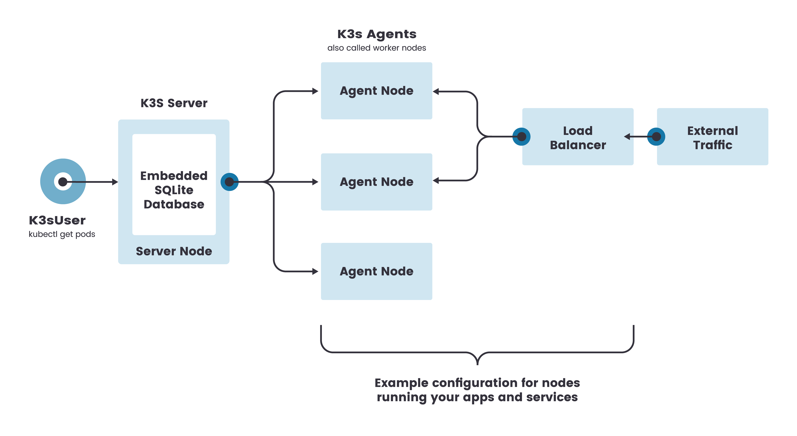
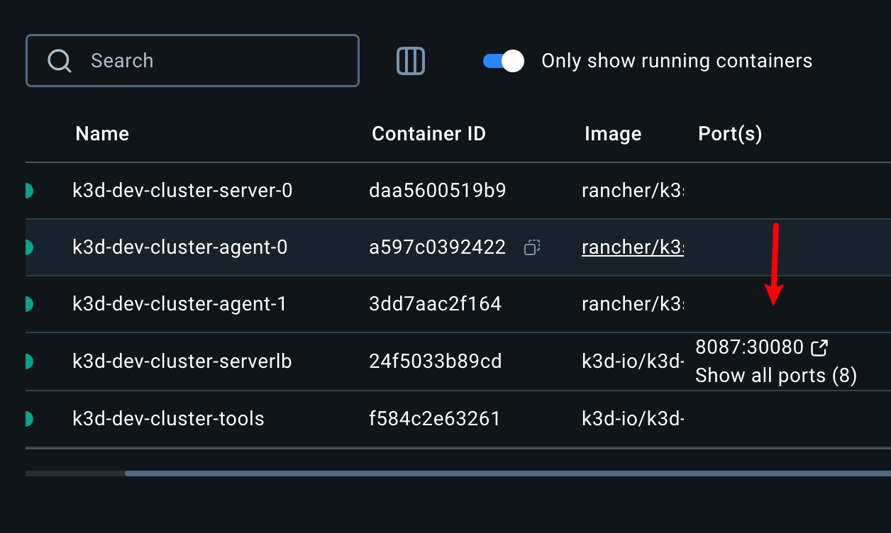
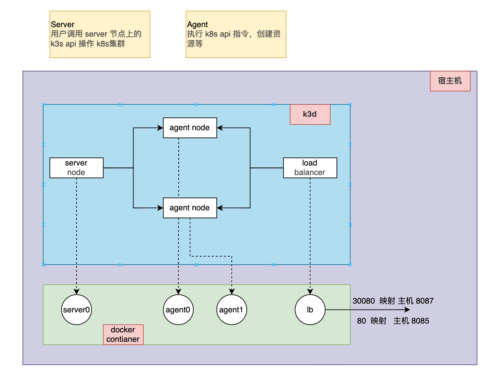
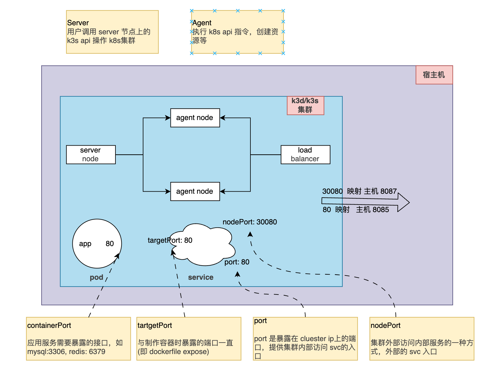
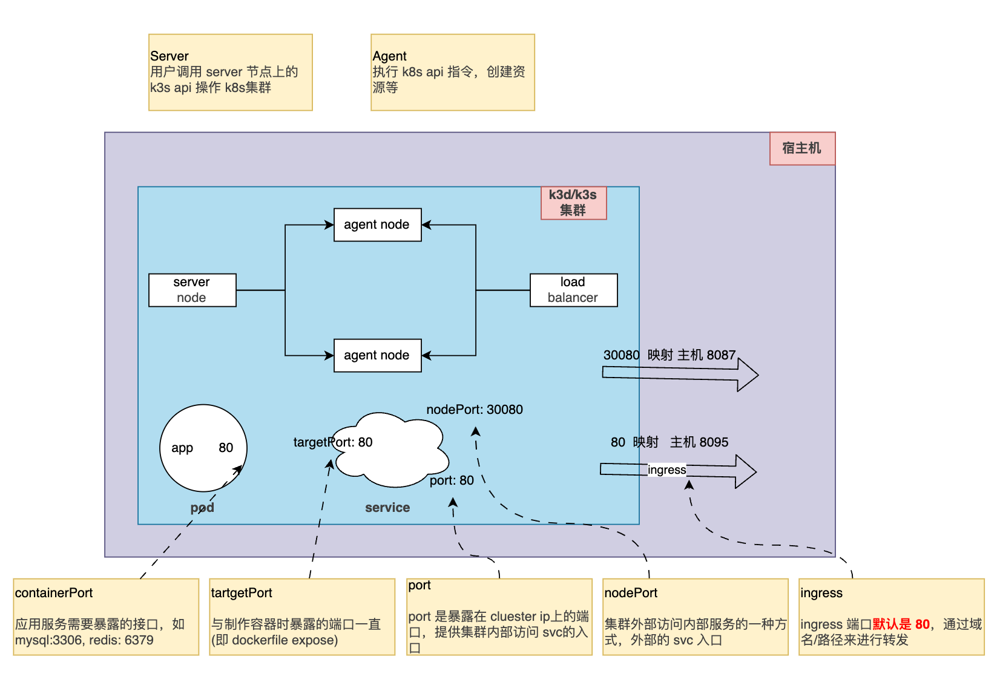
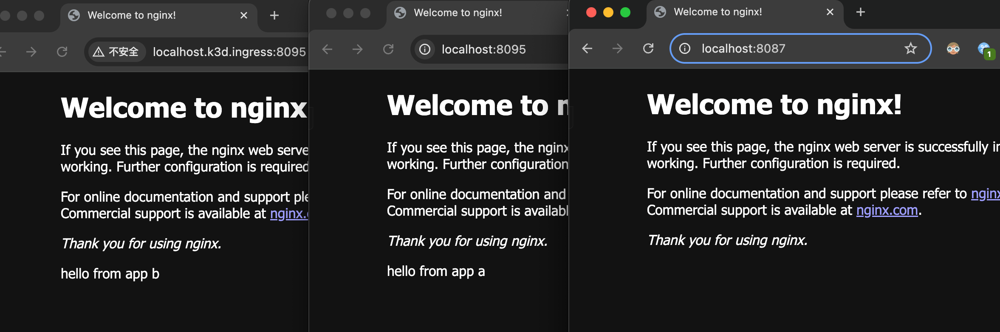
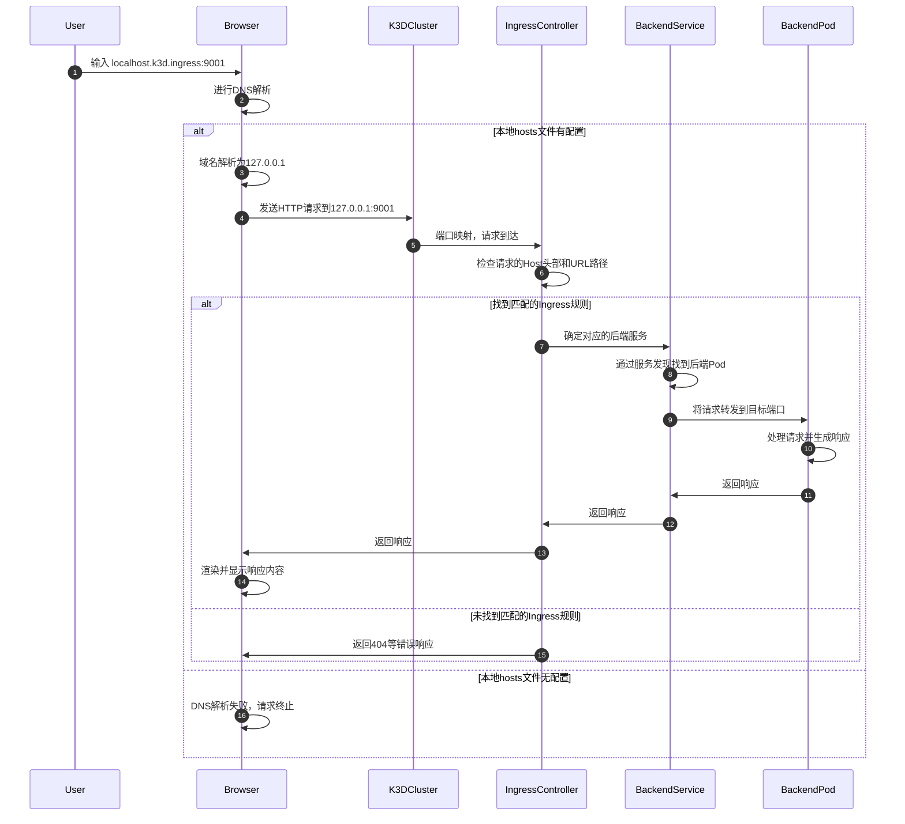

# 什么是 K3S

官网：[https://k3s.io/](https://k3s.io/)

指南：[https://rancher.com/docs/k3s/latest/en/](https://rancher.com/docs/k3s/latest/en/)

中文版指南：[https://docs.rancher.cn/docs/k3s/\_index/](https://docs.rancher.cn/docs/k3s/_index/)

K3s 是一个轻量级的 Kubernetes 发行版，它针对边缘计算、物联网等场景进行了高度优化，易于安装，全部在不到 100MB 的二进制文件中；非常适合

- Edge
- IoT
- CI
- **Development** (用的就是这个)
- ARM
- Embedding K8s
- Situations where a PhD in K8s clusterology is infeasible

可以理解为是 K8SLite 版，单词比 K8S 一半还少，所以叫 K3S

# 什么是 K3D

官网：[https://k3d.io/v5.3.0/](https://k3d.io/v5.3.0/)

指南：[https://k3d.io/v5.3.0/usage/configfile/](https://k3d.io/v5.3.0/usage/configfile/)

k3d 是一个轻量级的包装器，用于在 docker 中运行 k3s（Rancher Lab 的最小 Kubernetes 发行版）。

k3d 使得在 docker 中创建单节点和多节点 k3s 集群变得非常容易，例如在 Kubernetes 上进行本地开发。

对于我们研发人员，我们不希望花太多精力和时间去搭建和维护 K8S，那么我们使用 K3D 就能通过类似 docker 的方式来快速的构建 K3S 集群，所以两者加起来就相当于一个 K8S 了

# 目标

学习使用 k3d 创建比本地集群，并部署一个可访问的服务 nodeport/ingress ，并理清楚访问链路

# 下载工具

brew install k3d

# 1. 创建集群

根据下载的版本，需要用到两个 ghcr 仓库的镜像，使用代理提前下载好

```shell
docker pull ghcr.nju.edu.cn/k3d-io/k3d-tools:5.6.3

docker tag ghcr.nju.edu.cn/k3d-io/k3d-tools:5.6.3 ghcr.io/k3d-io/k3d-tools:5.6.3

docker pull ghcr.nju.edu.cn/k3d-io/k3d-proxy:5.6.3

docker tag ghcr.nju.edu.cn/k3d-io/k3d-proxy:5.6.3 ghcr.io/k3d-io/k3d-proxy:5.6.3

```

## 1. 使用 k3d 创建[单节点集群架构](https://links.jianshu.com/go?to=https%3A%2F%2Fdocs.rancher.cn%2Fdocs%2Fk3s%2Farchitecture%2F_index)



[mirrors 配置详情&gt;...](https://docs.rancher.cn/docs/k3s/installation/private-registry/_index/#mirrors)

[其他配置-&gt;非常详细的说明](https://links.jianshu.com/go?to=https%3A%2F%2Fk3d.io%2Fv5.3.0%2Fusage%2Fconfigfile%2F)

```yaml
apiVersion: k3d.io/v1alpha5
kind: Simple
metadata:
  name: dev-cluster
servers: 1
agents: 2
kubeAPI:
  hostPort: "6449"

ports:
  - port: 8085:80
    nodeFilters:
      - loadbalancer
  - port: 8087:30080
    nodeFilters:
      - loadbalancer
  - port: 8443:443
    nodeFilters:
      - loadbalancer

registries:
  config: |
    mirrors:
      docker.io:
        endpoint:
          - https://docker.m.daocloud.io

      quay.io:
        endpoint:
          - https://quay.m.daocloud.io

      gcr.io:
        endpoint:
          - https://gcr.m.daocloud.io

      k8s.gcr.io:
        endpoint:
          - https://k8s-gcr.m.daocloud.io

      ghcr.io:
        endpoint:
          - https://ghcr.m.daocloud.io

      registry.k8s.io:
        endpoint:
          - https://k8s.m.daocloud.io

    configs:
      docker.nju.edu.cn:
        auth:
```

执行如下命令

> k3d cluster create --config ./cluster-example.yaml

```shell
k3d cluster list
NAME               SERVERS   AGENTS   LOADBALANCER
dev-cluster        1/1       2/2      true
```

创建一个 server 节点，2 个 agents 节点 的集群，且集群的 30080 端口映射宿主机的 8087 端口，80 映射宿主机的 8085 (即 docker expose 的端口看 docker 容器可以看出来)

```shell
k3d node list
NAME                            ROLE           CLUSTER            STATUS
k3d-dev-cluster-agent-0         agent          dev-cluster        running
k3d-dev-cluster-agent-1         agent          dev-cluster        running
k3d-dev-cluster-server-0        server         dev-cluster        running
k3d-dev-cluster-serverlb        loadbalancer   dev-cluster        running
k3d-dev-cluster-tools                          dev-cluster        running
```

对应 docker 的 5 个容器



所以，宿主机，k3d, k3s ，docker 的关系如下



# 2. 创建可访问的服务

## nodeport 服务

简单的 nginx 服务

```yaml
apiVersion: apps/v1
kind: Deployment
metadata:
  labels:
    app: web
  name: web
spec:
  replicas: 1
  selector:
    matchLabels:
      app: web
  strategy: {}
  template:
    metadata:
      labels:
        app: web
    spec:
      containers:
        - image: nginx
          name: nginx
          ports:
            - containerPort: 80
          resources:
            limits:
              cpu: 100m
              memory: 256Mi
            requests:
              cpu: 80m
              memory: 128Mi
```

对应的 nodeport svc

```yaml
apiVersion: v1
kind: Service
metadata:
  labels:
    app: web-service
  name: app-service-nodeport
spec:
  ports:
    - name:
      nodePort: 30080
      port: 80
      protocol: TCP
      targetPort: 80
  selector:
    app: web
  type: NodePort
```

> kubectl apply -f deploy-nginx.yaml && kubectl apply -f nginx-svc-nodeport.yaml

```shell

k get pods,svc              ⎈ k3d-dev-cluster
NAME                         READY   STATUS    RESTARTS   AGE
pod/web-574cd456fb-wbk5x     1/1     Running   0          74m

NAME                           TYPE        CLUSTER-IP      EXTERNAL-IP   PORT(S)        AGE
service/app-service-a          ClusterIP   10.43.154.184   <none>        80/TCP         73m
```

本地访问 `localhost:8087`

```shell
curl localhost:8087
<!DOCTYPE html>
<html>
<head>
<title>Welcome to nginx!</title>
<style>
html { color-scheme: light dark; }
body { width: 35em; margin: 0 auto;
font-family: Tahoma, Verdana, Arial, sans-serif; }
</style>
</head>
<body>
<h1>Welcome to nginx!</h1>
<p>If you see this page, the nginx web server is successfully installed and
working. Further configuration is required.</p>

<p>For online documentation and support please refer to
<a href="http://nginx.org/">nginx.org</a>.<br/>
Commercial support is available at
<a href="http://nginx.com/">nginx.com</a>.</p>

<p><em>Thank you for using nginx.</em></p>
</body>
</html>
```



## ingress



使用当前目录下的文件的资源文件，创建工作负载

```shell
./ingress
├── cluster-example.yaml
├── deploy-a.yaml
├── deploy-b.yaml
├── nginx-ing-a.yaml
├── nginx-ing-b.yaml
├── nginx-svc-a.yaml
└── nginx-svc-b.yaml
```

```shell
k get pods,svc,ing          ⎈ k3d-dev-cluster
NAME                         READY   STATUS    RESTARTS   AGE
pod/web-574cd456fb-wbk5x     1/1     Running   0          92m
pod/web-a-6bbd7486b-rfsk5    1/1     Running   0          91m
pod/web-b-544fc48b65-r4sgt   1/1     Running   0          91m

NAME                           TYPE        CLUSTER-IP      EXTERNAL-IP   PORT(S)        AGE
service/kubernetes             ClusterIP   10.43.0.1       <none>        443/TCP        121m
service/app-service-a          ClusterIP   10.43.154.184   <none>        80/TCP         91m
service/app-service-b          ClusterIP   10.43.103.135   <none>        80/TCP         91m
service/app-service-nodeport   NodePort    10.43.233.136   <none>        80:30080/TCP   58m

NAME                                        CLASS     HOSTS                   ADDRESS                            PORTS   AGE
ingress.networking.k8s.io/app-ingress-a     traefik   localhost               172.23.0.3,172.23.0.4,172.23.0.5   80      91m
ingress.networking.k8s.io/nginx-ingress-b   traefik   localhost.k3d.ingress   172.23.0.3,172.23.0.4,172.23.0.5   80      91m
```

因为用的是同一个镜像，我们需要进入 a 和 b 的 pod 中更改 nginx 默认的 html 内容来区分

```shell
k exec -it -n default web-b-544fc48b65-r4sgt /bin/bash
kubectl exec [POD] [COMMAND] is DEPRECATED and will be removed in a future version. Use kubectl exec [POD] -- [COMMAND] instead.
root@web-b-544fc48b65-r4sgt:/# cd /usr/share/nginx/html/
root@web-b-544fc48b65-r4sgt:/usr/share/nginx/html# ls
50x.html  index.html
root@web-b-544fc48b65-r4sgt:/usr/share/nginx/html# echo 'hello from app b' >> index.html
```

本地只配置 host， 访问服务

> 127.0.0.1 localhost
> 127.0.0.1 localhost.k3d.ingress



## 访问链路



# 参考

1. [K3S + K3D = K8S a new perfect match for dev and test - Sokube](https://www.sokube.io/en/blog/k3s-k3d-k8s-a-new-perfect-match-for-dev-and-test-en)
2. [K3S+K3D=K8S 开发利器快速入门](https://www.jianshu.com/p/ee49766200ba)
3. [K3D + Nginx Ingress 控制器 - Tech Learning](https://erhwenkuo.github.io/kubernetes/01-getting-started/learning-env/k3d/k3d-with-nginx-ingresscontroller/)
4. [Kubernetes 学习（K3d）](https://zguishen.com/posts/ba3329f9.html)
