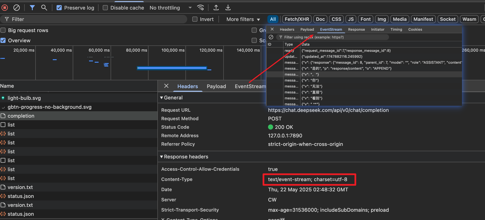

# 1. sse 基本介绍

SSE 与 WebSocket 作用相似，都是建立浏览器与服务器之间的通信渠道，然后服务器向浏览器推送信息。

总体来说，WebSocket 更强大和灵活。因为它是全双工通道，可以双向通信；SSE 是单向通道，只能服务器向浏览器发送，因为流信息本质上就是下载。如果浏览器向服务器发送信息，就变成了另一次 HTTP 请求。

目前大部分 chatai 都是基于 sse 实现的服务端推送数据给客户端。

如 deepseek API `https://chat.deepseek.com/api/v0/chat/completion`



### **为什么选择 SSE 而不是 WebSocket/gRPC？**

- **SSE** ：适合单向流式文本（服务器 → 客户端），浏览器原生支持，比 WebSocket 更轻量。
- **WebSocket** ：适用于双向实时交互（如语音聊天），但普通问答场景无需全双工通信。
- **gRPC** ：性能更高，但需额外依赖（如 gRPC-Web），调试复杂度增加。

# 2. node.js server

```nodejs
var http = require("http");

http.createServer(function (req, res) {
  var fileName = "." + req.url;

  if (fileName === "./stream") {
    res.writeHead(200, {
      "Content-Type":"text/event-stream",
      "Cache-Control":"no-cache",
      "Connection":"keep-alive",
      "Access-Control-Allow-Origin": '*',
    });
    res.write("retry: 10000\n");
    res.write("event: connecttime\n");
    res.write("data: " + (new Date()) + "\n\n");
    res.write("data: " + (new Date()) + "\n\n");

    interval = setInterval(function () {
      res.write("data: " + (new Date()) + "\n\n");
    }, 1000);

    req.connection.addListener("close", function () {
      clearInterval(interval);
    }, false);
  }
}).listen(8844, "127.0.0.1");

```

请将上面的代码保存为 `server.js`，然后执行下面的命令。

> ```bash
>
> $ node server.js
> ```

上面的命令会在本机的 `8844`端口，打开一个 HTTP 服务。

然后，打开这个[网页](http://jsbin.com/vuziboduwa/edit?html,output)，查看客户端代码并运行。

### 2.1 数据格式

服务器向浏览器发送的 SSE 数据，必须是 UTF-8 编码的文本，具有如下的 HTTP 头信息。

> ```markup
>
> Content-Type: text/event-stream
> Cache-Control: no-cache
> Connection: keep-alive
> ```

上面三行之中，第一行的 `Content-Type`必须指定 MIME 类型为 `event-steam`。

每一次发送的信息，由若干个 `message`组成，每个 `message`之间用 `\n\n`分隔。

每个 `message`内部由若干行组成，每一行都是如下格式。

> ```markup
>
> [field]: value\n
> ```

上面的 `field`可以取四个值。

> - data
> - event
> - id
> - retry

此外，还可以有冒号开头的行，表示注释。通常，服务器每隔一段时间就会向浏览器发送一个注释，保持连接不中断。

> ```markup
>
> : This is a comment
> ```

下面是一个例子。

> ```markup
>
> : this is a test stream\n\n
>
> data: some text\n\n
>
> data: another message\n
> data: with two lines \n\n
> ```

### 2.2 data 字段

数据内容用 `data`字段表示。

> ```markup
>
> data:  message\n\n
> ```

如果数据很长，可以分成多行，最后一行用 `\n\n`结尾，前面行都用 `\n`结尾。

> ```markup
>
> data: begin message\n
> data: continue message\n\n
> ```

下面是一个发送 JSON 数据的例子。

> ```markup
>
> data: {\n
> data: "foo": "bar",\n
> data: "baz", 555\n
> data: }\n\n
> ```

### 2.3 id 字段

数据标识符用 `id`字段表示，相当于每一条数据的编号。

> ```markup
>
> id: msg1\n
> data: message\n\n
> ```

浏览器用 `lastEventId`属性读取这个值。一旦连接断线，浏览器会发送一个 HTTP 头，里面包含一个特殊的 `Last-Event-ID`头信息，将这个值发送回来，用来帮助服务器端重建连接。因此，这个头信息可以被视为一种同步机制。

### 2.4 event 字段

`event`字段表示自定义的事件类型，默认是 `message`事件。浏览器可以用 `addEventListener()`监听该事件。

> ```markup
>
> event: foo\n
> data: a foo event\n\n
>
> data: an unnamed event\n\n
>
> event: bar\n
> data: a bar event\n\n
> ```

上面的代码创造了三条信息。第一条的名字是 `foo`，触发浏览器的 `foo`事件；第二条未取名，表示默认类型，触发浏览器的 `message`事件；第三条是 `bar`，触发浏览器的 `bar`事件。

下面是另一个例子。

> ```markup
>
> event: userconnect
> data: {"username": "bobby", "time": "02:33:48"}
>
> event: usermessage
> data: {"username": "bobby", "time": "02:34:11", "text": "Hi everyone."}
>
> event: userdisconnect
> data: {"username": "bobby", "time": "02:34:23"}
>
> event: usermessage
> data: {"username": "sean", "time": "02:34:36", "text": "Bye, bobby."}
> ```

### 2.5 retry 字段

服务器可以用 `retry`字段，指定浏览器重新发起连接的时间间隔。

> ```markup
>
> retry: 10000\n
> ```

两种情况会导致浏览器重新发起连接：一种是时间间隔到期，二是由于网络错误等原因，导致连接出错。

# 3. golang-sse-demo

## start server

> go run server/main.go

## visit index.html in chrom

> http://127.0.0.1:8844

## start publish

## stop receive

# 4. Ref

1. [server-sent_events](https://www.ruanyifeng.com/blog/2017/05/server-sent_events.html)
